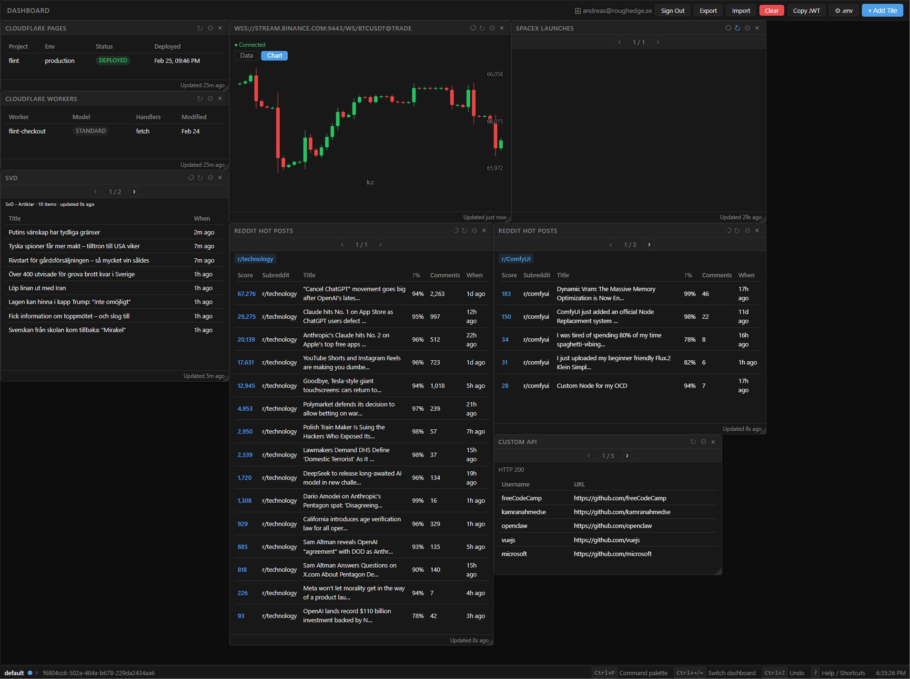

# Tiling Window Manager Dashboard

[](LICENSE)

A developer dashboard built with SolidJS + Bun that aggregates data from dozens of API providers into a customisable tiled layout. Tiles are arranged freely on a freeform canvas, persisted per workspace, and pushed live data via Server-Sent Events (SSE) from a local API server.



## Quick start

```bash
bun install
cp .env.example .env   # see Environment Variables below
bun run dev            # Vite frontend on :8080 + API server on :3001
```

Open [http://localhost:8080](http://localhost:8080). The dashboard works immediately with no keys configured — generic tiles (REST, WebSocket, RSS, GraphQL) are always available, and provider tiles activate as you add their credentials to `.env`.

### Available scripts

| Command | Description |
|---------|-------------|
| `bun run dev` | Start both Vite frontend (:8080) and API server (:3001) together |
| `bun run api` | API server only |
| `bun run watch-api` | API server with file-watch restart |
| `bun run build` | Production build |
| `bun run test` | Unit + integration tests |
| `bun run typecheck` | TypeScript type check |
| `bun run lint` | ESLint |

---

## Environment Variables

All configuration lives in `.env` (copy from `.env.example`). The API server reads it at startup. After changing any value you can either restart the server or call `reload_env` via MCP without restarting.

### How providers activate

Each provider section in `.env` is **opt-in**. A provider's poller only starts when its required credentials are present. Tiles for unconfigured providers will show a "not configured" state rather than crashing.

```
# Example: Stripe activates as soon as STRIPE_SECRET_KEY is set
STRIPE_SECRET_KEY=sk_test_...
STRIPE_WEBHOOK_SECRET=whsec_...   # optional, only needed for webhook tiles
```

### Key groups

| Group | Required vars | Notes |
|-------|--------------|-------|
| **Stripe** | `STRIPE_SECRET_KEY` | `STRIPE_WEBHOOK_SECRET` only for webhook tiles |
| **GitHub** | `GITHUB_TOKEN`, `GITHUB_ORG` or `GITHUB_USER` | PAT with `read:org` + `workflow` scopes |
| **Cloudflare** | `CF_API_TOKEN`, `CF_ACCOUNT_ID` | Token needs Account:Read + Pages:Read |
| **CoinGecko** | _(none — public API)_ | `COINGECKO_COINS=bitcoin,ethereum` to enable price/chart tiles |
| **Reddit** | _(none — public API)_ | Subreddits configured per-tile, not globally |
| **Hacker News** | _(none — public API)_ | Always works |
| **Alpha Vantage** | `ALPHA_VANTAGE_KEY` | `AV_SYMBOLS=AAPL,TSLA` sets tracked tickers |
| **Finnhub** | `FINNHUB_TOKEN` | `FH_SYMBOLS=AAPL,TSLA` sets tracked tickers |
| **Linear** | `LINEAR_API_KEY` | |
| **Jira** | `JIRA_HOST`, `JIRA_EMAIL`, `JIRA_API_TOKEN` | |
| **Slack** | `SLACK_BOT_TOKEN` | `SLACK_CHANNELS=C012345` |
| **Plaid** | `PLAID_CLIENT_ID`, `PLAID_SECRET`, `PLAID_ACCESS_TOKEN` | |
| **WooCommerce** | `WC_BASE_URL`, `WC_CONSUMER_KEY`, `WC_CONSUMER_SECRET` | |
| **Shopify** | `SHOPIFY_SHOP`, `SHOPIFY_ACCESS_TOKEN` | |

See `.env.example` for the full list of all 35 providers and their optional poll-interval overrides (`*_POLL_MS`).

### Poll intervals

Every provider has a default poll interval. You can override any of them per-provider:

```env
STRIPE_POLL_MS=30000          # how often to re-fetch payments (default 30s)
GITHUB_POLL_MS=30000          # GitHub Actions runs (default 30s)
CG_POLL_MS=300000             # CoinGecko prices (default 5 min)
```

### Authentication

```env
AUTH_ENABLED=true             # require login (local username/password stored in auth.db)
JWT_SECRET=your_secret        # must be stable across restarts
AUTH_PROVIDER=local           # or 'saml' for SAML 2.0 SSO (Okta, Azure AD, Google Workspace)
```

When `AUTH_ENABLED=false` (default) the dashboard is open with no login required — suitable for local dev.

### Ports and URLs

```env
API_PORT=3001                 # API server port
FIXTURES_PORT=8080            # Vite dev server port
VITE_API_URL=                 # leave empty — Vite proxies /api/* to localhost:3001 automatically
```

---

## Tile Architecture

### Frontend

Tiles are SolidJS components. Every tile follows the same pattern:

1. **`TileConfig.ts`** — defines the `TileType` union (139 types) and the `TileConfig` shape (id, type, x, y, w, h, plus provider-specific fields).
2. **`tileRegistry.ts`** — a `TILE_REGISTRY` array of `TileDefinition` objects (label, icon, category, tags) used to populate the "Add Tile" modal and search UI.
3. **`renderTile.tsx`** — a single `switch` that maps every `TileType` to its component. This is the only place you wire a new tile type to its UI.
4. **`BaseTile.tsx`** — a shared wrapper component that every tile uses. Handles the loading skeleton, error display, and consistent CSS class. Tile components only need to render their data content.
5. **`TileGrid.tsx`** — the freeform canvas. Tiles are absolutely positioned, draggable via pointer events, and resizable. Layout is saved to localStorage and synced to the server on every change.
6. **`tilePersistence.ts`** — save/load functions. Layout is stored both in `localStorage` (instant restore on reload) and synced to the API server (`POST /api/layout`) so MCP agents see the live state.

**Data flow in a provider tile:**

```
API server poller (setInterval)
  → fetches external API
  → caches result in memory
  → broadcasts via SSE (GET /api/events)
    → useSseChannel() hook in the tile component
      → reactive SolidJS signal
        → UI re-renders
```

**Data flow in a generic tile (REST/WebSocket/GraphQL/RSS):**

```
Tile component (browser)
  → fetches/connects directly from the browser
  → reactive SolidJS signal
    → UI re-renders
```

### Server

The API server (`api/server.ts`) is a plain Bun HTTP server (no framework). It has three main responsibilities:

**1. SSE event bus** (`GET /api/events`)  
All connected browser clients subscribe to a single SSE stream. The server maintains a set of active `Response` writers and broadcasts to all of them whenever a poller produces new data.

**2. Provider pollers** (`api/providers/*.ts`)  
Each provider file exports a `register(ctx)` function. At startup, `server.ts` calls every `register()` function, which sets up `ctx.poll(channel, interval, dataFn)` calls. The `poll()` function runs `dataFn` immediately and then on a `setInterval`, caching the result and broadcasting it to the SSE bus.

Adding a new provider means:
- Creating `api/providers/myprovider.ts` with a `register()` function
- Calling `ctx.poll('my-channel', intervalMs, async () => { ... })` inside it
- Registering it in `server.ts` with `registerMyProvider(ctx)`

**3. Tile layout API** (`/api/layout`)  
`GET /api/layout` — read saved layout from SQLite (`auth.db`)  
`POST /api/layout` — save layout for the current user/workspace  
`DELETE /api/layout/:workspace` — delete a workspace

Layout is stored per user (when auth is enabled) or as a shared default (when auth is disabled).

### Tile component structure

Each provider has a folder under `src/tiles/<provider>/` containing one file per tile type. All provider tiles use the `useSseChannel` hook to subscribe to their SSE channel:

```tsx
// src/tiles/stripe/PaymentsTile.tsx (simplified)
export function PaymentsTile(): JSX.Element {
  const { data, loading, error } = useSseChannel<StripePayment[]>('stripe-payments', []);
  return (
    <BaseTile loading={loading()} error={error()}>
      <For each={data()}>{payment => <PaymentRow payment={payment} />}</For>
    </BaseTile>
  );
}
```

Generic tiles (REST, WebSocket, GraphQL, RSS) fetch data themselves in the browser — they do not go through the SSE bus. Their config is stored inline in the `TileConfig` under a type-specific sub-key (`tile.rest`, `tile.ws`, `tile.graphql`, `tile.rss`).

## Agent / MCP access

The server exposes a [Model Context Protocol](https://modelcontextprotocol.io) endpoint so LLM agents (Claude Desktop, Cursor, Copilot Chat, etc.) can read and control the dashboard.

### Enabling MCP

Add to your `.env`:

```env
MCP_ENABLED=true
# Optional: require a JWT to call mutating tools (defaults to AUTH_ENABLED)
# MCP_AUTH_REQUIRED=true
```

Restart the API server (`bun run api`). The endpoint is now live at:

| Transport | URL |
|-----------|-----|
| HTTP (single request) | `POST http://localhost:3001/api/mcp` |
| SSE (streaming notifications) | `GET  http://localhost:3001/api/mcp` |

### Connecting Claude Desktop

Add to `~/Library/Application Support/Claude/claude_desktop_config.json` (macOS) or `%APPDATA%\Claude\claude_desktop_config.json` (Windows):

```json
{
  "mcpServers": {
    "twm": {
      "command": "curl",
      "args": ["-s", "-N", "-X", "GET", "http://localhost:3001/api/mcp"]
    }
  }
}
```

For auth-enabled deployments, add `"-H", "Authorization: Bearer <your-jwt>"` to `args`.

### Resources

| URI | Description |
|-----|-------------|
| `dashboard://tiles` | Full tile layout array for the current user |
| `dashboard://layout` | Active SSE channels and connection statistics |

### Tools

All mutating tools are auth-gated when `MCP_AUTH_REQUIRED=true`.

| Tool | Description |
|------|-------------|
| `add_tile` | Append a new tile to the dashboard (`type`, optional `config`, `x`, `y`, `w`, `h`) |
| `remove_tile` | Remove a tile by `id` |
| `update_tile` | Merge a `patch` object into a tile by `id` |
| `reload_env` | Reload `.env` and apply updated environment variables |
| `get_tile_data` | Return the latest cached SSE data for a `channel` name |

### Prompts

| Prompt | Description |
|--------|-------------|
| `dashboard_summary` | Markdown table of all tiles (type, title, endpoint) |

### Example — list tiles via HTTP

```bash
curl -s -X POST http://localhost:3001/api/mcp \
  -H "Content-Type: application/json" \
  -d '{"jsonrpc":"2.0","id":1,"method":"resources/read","params":{"uri":"dashboard://tiles"}}'
```

### Example — add a tile

```bash
curl -s -X POST http://localhost:3001/api/mcp \
  -H "Content-Type: application/json" \
  -H "Authorization: Bearer <token>" \
  -d '{
    "jsonrpc": "2.0", "id": 2, "method": "tools/call",
    "params": {
      "name": "add_tile",
      "arguments": { "type": "ws", "config": { "url": "wss://example.com/feed" } }
    }
  }'
```
